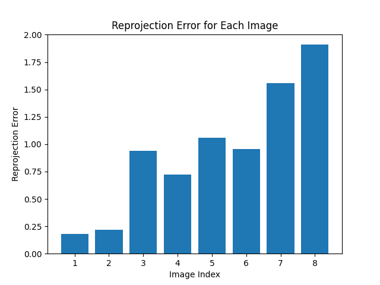

# CSCI599
3D Vision Assignment Template for Spring 2024.

The following tutorial will go through you with how to use three.js for your assignment visualization. Please make sure your VScode is installed with "Live Server" plugin.

## Table of Contents
- [How to use](#how-to-use)
- [Assignment 1: Geometry Processing](#assignment-1-geometry-processing)
    - [Introduction](#introduction)
    - [Requirements / Rubric](#requirements--rubric)
    - [My Result](#my-result)
        - [Loop subdivision](#loop-subdivision)
        - [Quadratic Error based mesh decimation](#quadratic-error-based-mesh-decimation)
- [Assignment 2: Structure From Motion](#assignment-2-structure-from-motion)
    - [Introduction](#introduction-1)
    - [Requirements / Rubric](#requirements--rubric-1)

    
## How to use
```shell
git clone https://github.com/jingyangcarl/CSCI599.git
cd CSCI599
ls ./ # you should see index.html and README.md showup in the terminal
code ./ # open this folder via vscode locally
# open and right click on the index.html
# select "Open With Live Server" to run the code over localhost.
```

## Assignment 1: Geometry Processing


### Introduction
In this assignment, you will implement surface subdivision and simplification using **Loop Subdivision** and **Quadric Error Metrics**, respectively. The task requires the construction of a data structure with adjacency, such as half-edge or incidence matrices, to facilitate quick traversal of mesh regions for computations. You can find the algorithms in the class lectures. The outcome will be an upsampled or downsampled version of a given mesh.

The following files are used:
- `assignments/assignment1.py`
- `html/assignment1.html`
- `js/assignment1.js`

### Requirements / Rubric
* +40 pts: Implement loop subdivision.
* +40 pts: Implement Quadratic Error based mesh decimation.
* +20 pts: Write up your project, detials of data structure, algorithms, reporting runtime and visualiztions of results with different parameters.
* +10 pts: Extra credit (see below)
* -5*n pts: Lose 5 points for every time (after the first) you do not follow the instructions for the hand in format

**Forbidden** You are not allowed to call subdivision or simpilication functions directly. Reading, visualization and saving of meshes are provided in the start code.

**Extract Credit** You are free to complete any extra credit:

* up to 5 pts:Analyze corner cases (failure cases) and find solutions to prevent them.
* up to 10 pts: Using and compare two different data structures.
* up to 10 pts: Impelemnt another subdivision or simplication algorithm.
* up to 10 pts: Can we preserve the original vertices after decimation (the vertices of the new meshes are a subset of the original vertices) ? Give it a try.

For all extra credit, be sure to demonstrate in your write up cases where your extra credit.

### My Result
You can run by typing `python assignments/assignment1.py`
After `if __name__ == '__main__'`:
- Uncomment `mesh_subdivided = subdivision_loop_halfedge(mesh)` and `mesh_subdivided.export('assets/assignment1/cube_subdivided.obj')` for generate mesh subdivided results.
- Uncomment `mesh_decimated = simplify_quadric_error(mesh, face_count=500)` and `mesh_decimated.export('assets/assignment1/bunny_decimated_500.obj')` for generate mesh decimated results.

Demo model:
- Cube: originally 8 vertices and 6 faces
- Bunny: originally 2503 vertices and 4968 faces
- Face: originally 8807 vertices and 17256 faces

#### Loop subdivision
- I use half edge data structure for loop subdivision. My implementation is slow due to the twin setting of half edge.

| Attributes | Trimesh | My implementation |
|-------|-------|-------|
| Cube for 1 iter |  |  |
| Time | 0.0067365s | 0.0011031s |
| Cube for 2 iter |  |  |
| Time | 0.007020s | 0.011545s |
| Cube for 3 iter |  |  |
| Time | 0.008119s | 0.13042s |
| Cube for 4 iter |  |  |
| Time | 0.01047s | 2.045044s |


#### Quadratic Error based mesh decimation


| Attributes | Trimesh | My implementation |
|-------|-------|-------|
| Bunny to 2000 faces |  |  |
| Time | 1.25s | 6.4s |
| Bunny to 500 faces |  |  |
| Time | 1.30s | 6.76s |
| Face to 10000 faces |  |  |
| Time | 1.09s | 59.90s |
| Face to 2000 faces |  |  |
| Time | 1.13s | 96.66s |

## Assignment 2: Structure From Motion


### Introduction
In this assignment, you will implement structure from motion in computer vision. Structure from motion (SFM) is a technique used to reconstruct the 3D structure of a scene from a sequence of 2D images or video frames. It involves estimating the camera poses and the 3D positions of the scene points.

The goal of SFM is to recover the 3D structure of the scene and the camera motion from a set of 2D image correspondences. This can be achieved by solving a bundle adjustment problem, which involves minimizing the reprojection error between the observed 2D points and the projected 3D points.

To implement SFM, you will need to perform the following steps:
1. Feature extraction: Extract distinctive features from the input images.
2. Feature matching: Match the features across different images to establish correspondences.
3. Camera pose estimation: Estimate the camera poses for each image.
4. Triangulation: Compute the 3D positions of the scene points using the camera poses and the corresponding image points.
5. Bundle adjustment: Refine the camera poses and the 3D points to minimize the reprojection error.

By implementing SFM, you will gain hands-on experience with fundamental computer vision techniques and learn how to reconstruct 3D scenes from 2D images. This assignment will provide you with a solid foundation for further studies in computer vision and related fields.

The following files are used:
- `assignments/assignment2/assignment2.py`
- `assignments/assignment2/feat_match.py`
- `assignments/assignment2/sfm.py`
- `assignments/assignment2/utils.py`
- `html/assignment2.html`
- `js/assignment2.js`

### Requirements / Rubric
* +80 pts: Implement the structure-from-motion algorithm with the start code.  
* +20 pts: Write up your project, algorithms, reporting results (reprojection error) and visualisations (point cloud and camera pose), compare your reconstruction with open source software Colmap.
* +10 pts: Extra credit (see below)
* -5*n pts: Lose 5 points for every time (after the first) you do not follow the instructions for the hand in format

**Extract Credit** You are free to complete any extra credit:

* up to 5 pts: Present results with your own captured data.
* up to 10 pts: Implement Bundle Adjustment in incremental SFM.
* up to 10 pts: Implement multi-view stereo (dense reconstruction).
* up to 20 pts: Create mobile apps to turn your SFM to a scanner.  
* up to 10 pts: Any extra efforts you build on top of basic SFM.

For all extra credit, be sure to demonstrate in your write up cases where your extra credit.

### My Result
You can run by typing `python assignments/assignment2/assignment2.py` or seperately `python assignments/assignment2/feat_match.py` for feature matching and `python assignments/assignment2/sfm.py` for whole structure from motion pipeline.

For base credits, I implement the structure-from-motion algorithm with the start code, fill all TODOs in the code.

Here are the comparison of my result and the colmap result 
| Dataset | Projection Errors for each image | Point cloud result | Camera result | COLMAP result |
|---------|----------------------------------|-------------------------------|---------------|---------------|
| castle-P19 |  |  |   |  |
| castle-P30 |  |  |  |  |
| entry-P10 |  |  |  |  |
| fountain-P11 |  |  |  |  |
| Herz-Jesus-P8 |  |  |  |  |
| Herz-Jesus-P25 |  |  |  |  |


#### Loop subdivision
- I use half edge data structure for loop subdivision. My implementation is slow due to the twin setting of half edge.

| Attributes | Trimesh | My implementation |
|-------|-------|-------|
| Cube for 1 iter |  |  |
| Time | 0.0067365s | 0.0011031s |
| Cube for 2 iter |  |  |
| Time | 0.007020s | 0.011545s |
| Cube for 3 iter |  |  |
| Time | 0.008119s | 0.13042s |
| Cube for 4 iter |  |  |
| Time | 0.01047s | 2.045044s |