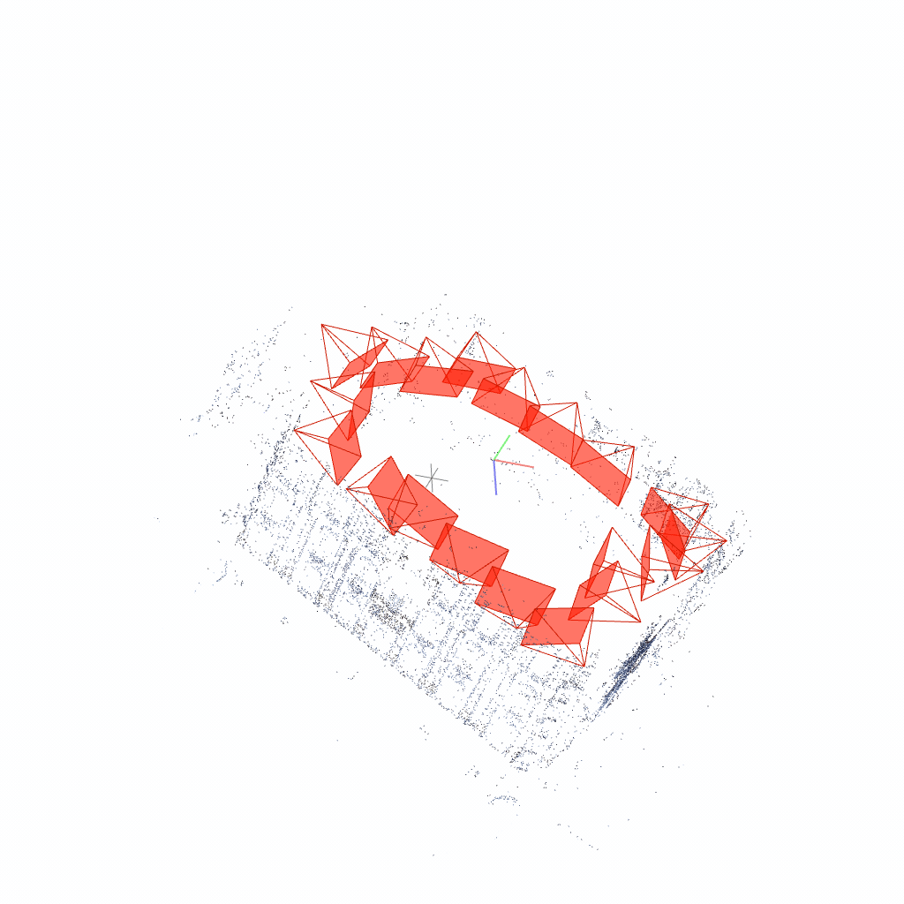
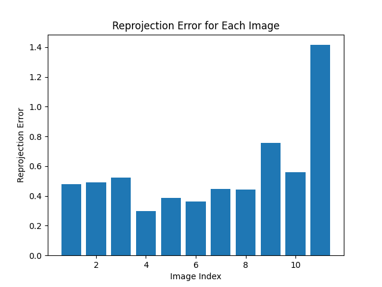

# CSCI599
3D Vision Assignment Template for Spring 2024.

The following tutorial will go through you with how to use three.js for your assignment visualization. Please make sure your VScode is installed with "Live Server" plugin.

## Table of Contents
1. [How to use](#how-to-use)
2. [Assignment 1: Geometry Processing](#assignment-1-geometry-processing)
   - [Mesh Decimation](#mesh-decimation)
   - [Introduction](#introduction-1)
   - [Requirements / Rubric](#requirements--rubric)
   - [My Result](#my-result)
     * [Loop subdivision](#loop-subdivision)
     * [Quadratic Error based mesh decimation](#quadratic-error-based-mesh-decimation)
3. [Assignment 2: Structure From Motion](#assignment-2-structure-from-motion)
   - [Introduction](#introduction-2)
   - [Requirements / Rubric](#requirements--rubric-1)
   - [My Results](#my-results)
     * [Extra Credit - My Dataset](#extra-credit---my-dataset)
     * [Extra Credit - Post-Processing for Point Cloud](#extra-credit---post-processing-for-point-cloud)
     * [Extra Credit - Bundle Adjustment](#extra-credit---bundle-adjustment)
4. [Assignment 3: NeRF / 3DGS](#assignment-3-nerf--3dgs)
   - [Introduction](#introduction-3)
   - [Requirements / Rubric](#requirements--rubric-2)
   - [My result](#my-result-1)
     * [Data Collection](#data-collection)
     * [COLMAP Reconstruction](#colmap-reconstruction)
     * [NeRF](#nerf)
     * [3D Gaussian Splatting](#3d-gaussian-splatting)


## How to use
```shell
git clone https://github.com/jingyangcarl/CSCI599.git
cd CSCI599
ls ./ # you should see index.html and README.md showup in the terminal
code ./ # open this folder via vscode locally
# open and right click on the index.html
# select "Open With Live Server" to run the code over localhost.
```

## Assignment 1: Geometry Processing


### Introduction
In this assignment, you will implement surface subdivision and simplification using **Loop Subdivision** and **Quadric Error Metrics**, respectively. The task requires the construction of a data structure with adjacency, such as half-edge or incidence matrices, to facilitate quick traversal of mesh regions for computations. You can find the algorithms in the class lectures. The outcome will be an upsampled or downsampled version of a given mesh.

The following files are used:
- `assignments/assignment1.py`
- `html/assignment1.html`
- `js/assignment1.js`

### Requirements / Rubric
* +40 pts: Implement loop subdivision.
* +40 pts: Implement Quadratic Error based mesh decimation.
* +20 pts: Write up your project, detials of data structure, algorithms, reporting runtime and visualiztions of results with different parameters.
* +10 pts: Extra credit (see below)
* -5*n pts: Lose 5 points for every time (after the first) you do not follow the instructions for the hand in format

**Forbidden** You are not allowed to call subdivision or simpilication functions directly. Reading, visualization and saving of meshes are provided in the start code.

**Extract Credit** You are free to complete any extra credit:

* up to 5 pts:Analyze corner cases (failure cases) and find solutions to prevent them.
* up to 10 pts: Using and compare two different data structures.
* up to 10 pts: Impelemnt another subdivision or simplication algorithm.
* up to 10 pts: Can we preserve the original vertices after decimation (the vertices of the new meshes are a subset of the original vertices) ? Give it a try.

For all extra credit, be sure to demonstrate in your write up cases where your extra credit.

### My Result
You can run by typing `python assignments/assignment1.py`
After `if __name__ == '__main__'`:
- Uncomment `mesh_subdivided = subdivision_loop_halfedge(mesh)` and `mesh_subdivided.export('assets/assignment1/cube_subdivided.obj')` for generate mesh subdivided results.
- Uncomment `mesh_decimated = simplify_quadric_error(mesh, face_count=500)` and `mesh_decimated.export('assets/assignment1/bunny_decimated_500.obj')` for generate mesh decimated results.

Demo model:
- Cube: originally 8 vertices and 6 faces
- Bunny: originally 2503 vertices and 4968 faces
- Face: originally 8807 vertices and 17256 faces

#### Loop subdivision
- I use half edge data structure for loop subdivision. My implementation is slow due to the twin setting of half edge.

| Attributes | Trimesh | My implementation |
|-------|-------|-------|
| Cube for 1 iter |  |  |
| Time | 0.0067365s | 0.0011031s |
| Cube for 2 iter |  |  |
| Time | 0.007020s | 0.011545s |
| Cube for 3 iter |  |  |
| Time | 0.008119s | 0.13042s |
| Cube for 4 iter |  |  |
| Time | 0.01047s | 2.045044s |


#### Quadratic Error based mesh decimation


| Attributes | Trimesh | My implementation |
|-------|-------|-------|
| Bunny to 2000 faces |  |  |
| Time | 1.25s | 6.4s |
| Bunny to 500 faces |  |  |
| Time | 1.30s | 6.76s |
| Face to 10000 faces |  |  |
| Time | 1.09s | 59.90s |
| Face to 2000 faces |  |  |
| Time | 1.13s | 96.66s |

## Assignment 2: Structure From Motion


### Introduction
In this assignment, you will implement structure from motion in computer vision. Structure from motion (SFM) is a technique used to reconstruct the 3D structure of a scene from a sequence of 2D images or video frames. It involves estimating the camera poses and the 3D positions of the scene points.

The goal of SFM is to recover the 3D structure of the scene and the camera motion from a set of 2D image correspondences. This can be achieved by solving a bundle adjustment problem, which involves minimizing the reprojection error between the observed 2D points and the projected 3D points.

To implement SFM, you will need to perform the following steps:
1. Feature extraction: Extract distinctive features from the input images.
2. Feature matching: Match the features across different images to establish correspondences.
3. Camera pose estimation: Estimate the camera poses for each image.
4. Triangulation: Compute the 3D positions of the scene points using the camera poses and the corresponding image points.
5. Bundle adjustment: Refine the camera poses and the 3D points to minimize the reprojection error.

By implementing SFM, you will gain hands-on experience with fundamental computer vision techniques and learn how to reconstruct 3D scenes from 2D images. This assignment will provide you with a solid foundation for further studies in computer vision and related fields.

The following files are used:
- `assignments/assignment2/assignment2.py`
- `assignments/assignment2/feat_match.py`
- `assignments/assignment2/sfm.py`
- `assignments/assignment2/utils.py`
- `html/assignment2.html`
- `js/assignment2.js`

### Requirements / Rubric
* +80 pts: Implement the structure-from-motion algorithm with the start code.  
* +20 pts: Write up your project, algorithms, reporting results (reprojection error) and visualisations (point cloud and camera pose), compare your reconstruction with open source software Colmap.
* +10 pts: Extra credit (see below)
* -5*n pts: Lose 5 points for every time (after the first) you do not follow the instructions for the hand in format

**Extract Credit** You are free to complete any extra credit:

* up to 5 pts: Present results with your own captured data.
* up to 10 pts: Implement Bundle Adjustment in incremental SFM.
* up to 10 pts: Implement multi-view stereo (dense reconstruction).
* up to 20 pts: Create mobile apps to turn your SFM to a scanner.  
* up to 10 pts: Any extra efforts you build on top of basic SFM.

For all extra credit, be sure to demonstrate in your write up cases where your extra credit.

### My Results
You can run the code by typing `python assignments/assignment2/assignment2.py` or separately `python assignments/assignment2/feat_match.py` for feature matching and `python assignments/assignment2/sfm.py` for the whole structure-from-motion pipeline.

For base credits, I implemented the structure-from-motion algorithm with the provided starter code, filling all TODOs in the code.

Here are the comparisons of my results with the COLMAP results. For the reconstructed ply files, you can check in `./assets/assignment2/<dataset_name>.ply`.

| Dataset          | Projection Errors for each image       | Point cloud result             | Camera result                | COLMAP result                |
|------------------|----------------------------------------|--------------------------------|------------------------------|------------------------------|
| castle-P19       |       |  |  |  |
| castle-P30       |       |  |  |  |
| entry-P10        |       |  |  |  |
| fountain-P11     |     |  |  |  |
| Herz-Jesus-P8    |    |  |  |  |
| Herz-Jesus-P25   |   |  |  |  |

#### Extra Credit - My Dataset
I captured this video data at the Petersen Automotive Museum. It is me holding a phone and capturing this car from different angles. The original data is a video. I extracted 10 images per second from the video to generate a dataset of 50 pictures.

|  |  |
|---------------------------|---------------------------|
| Example data 1            | Example data 2            |

|  |     |
|-----------------------------|------------------------------|
| Projection Errors for each image | Point cloud demonstration |

#### Extra Credit - Post-Processing for Point Cloud
I noticed that the point cloud generated by the original algorithm had some outliers. I tried using RANSAC to remove the outliers, but it didn't improve the results. Therefore, I adopted a post-processing approach for the point cloud. This function uses the k-nearest neighbors (k-NN) algorithm to remove outliers from the point cloud. For each point, it calculates the average distance to its k nearest neighbors. Then, based on the median of these average distances, a threshold is determined. If a point's average distance to its k nearest neighbors is greater than this threshold multiplied by a threshold_factor, the point is considered an outlier and removed from the point cloud. The purpose of this method is to remove points that are far away from the majority, thereby reducing noise and improving the quality of the point cloud. The visualized results in the demonstration are after removing the outliers using this algorithm. The parameters I used were k=10 and threshold_factor=5. The relevant code can be found in `post.py`.

#### Extra Credit - Bundle Adjustment
There are four steps in bundle adjustment:
1. **Parameter Preparation:** Integrating the camera's rotation and translation parameters along with the coordinates of the 3D points into a parameter vector.
2. **Error Function:** Defining an error function that calculates the discrepancy between all 2D points and their corresponding 3D points projected through the camera parameters.
3. **Optimization Process:** Using a non-linear least squares optimization algorithm to adjust the camera parameters and 3D point coordinates to minimize the total reprojection error.
4. **Parameter Update:** After the optimization, extracting the updated camera parameters and 3D point coordinates and updating the original parameters.

In `sfm.py`, the bundle adjustment can be used with the option `--bundle_adjustment true`.
(Suggest don't run this, scipy.optimize takes too long)

## Assignment 3: NeRF / 3DGS

### Introduction 
A Neural Radiance Field (NeRF) is a computer vision technique for constructing highly detailed 3D scenes from sets of 2D images. It uses a deep neural network to map spatial coordinates and viewing angles to color and density, enabling the rendering of new viewpoints in complex environments. This makes NeRF valuable for applications in virtual reality and visual effects

Recent advancements in novel-view synthesis have introduced a method using 3D Gaussians to improve visual quality while maintaining real-time display rates. This technique employs sparse points from camera calibration to represent scenes with 3D Gaussians, preserving the characteristics of volumetric radiance fields. It includes an optimization and density control mechanism, along with a rapid, visibility-aware rendering algorithm that supports anisotropic splatting. This method effectively generates high-quality 3D scenes from 2D images in real-time.

In this assignment, you'll play around with these neural renderings and train your own NeRF/3DGS.

The following files are used:
- `community colabs or repos`
- `html/assignment3.html`
- `js/assignment3.js`

### Requirements / Rubric
* +80 pts: Complete the training using your own data.
* +20 pts: Write up your project, algorithms, reporting results (reprojection error) and visualisations, compare your reconstruction with open source software Colmap.
* +10 pts: Extra credit (see below)
* -5*n pts: Lose 5 points for every time (after the first) you do not follow the instructions for the hand in format

**Extract Credit** You are free to complete any extra credit:

* up to 5 pts: Present results with your own captured data.
* up to 10 pts: Train your models with both Nerf and 3DGS.
* up to 20 pts: Train your model with language embedding (e.g., LERF).

For all extra credit, be sure to demonstrate in your write up cases where your extra credit.

### My result
In this project, I leveraged the Carla simulator to collect a dataset from the Town10HD map, consisting of 378 images split evenly between aerial and street views. These images served as the basis for constructing a 3D scene using both Colmap and NeRF techniques.

#### Data Collection
The dataset comprises 378 images obtained from two perspectives:
- Aerial view
- Street view

These images were sourced from the [Carla Simulator](https://carla.org/), specifically from the Town10HD map. Below is a GIF that illustrates all the input views:


#### COLMAP Reconstruction
Utilizing the known camera poses, I built a 3D model with COLMAP. The precise camera poses contributed to a high-quality point cloud, suggesting accurate reconstruction in alignment with the real-world scene layout.


#### NeRF 
I employed NeRF Studio for training a vanilla NeRF model based on the initial COLMAP results. The NeRF training was configured as follows:

- **Iterations:** 30,000
- **Optimizer:** Adam, starting learning rate of 0.01, with exponential decay.
- **Precision:** Mixed precision for efficient training.

Further configuration details for the NeRF model include:
- **Base Resolution:** 16
- **Maximum Resolution:** 2048
- **Number of Levels:** 16
- **Hidden Dimensions:** 64 for both density and color

The NeRF model effectively generated a 3D representation of the scene, accurately capturing both geometric and photometric details. Below is a GIF that showcases the NeRF results:

However, it can be seen that in parts where there is insufficient information, such as the edges of the city or areas with less photo coverage, the scene becomes blurry and the geometric reconstruction is not accurate.


#### 3D Gaussian Splatting
3D Gaussian Splatting is a volumetric rendering technique optimized for achieving high-quality geometric reconstructions. This method utilizes an advanced training regimen and parameter optimization designed to refine and densify the representation of a scene over time.

The configuration for training the 3D Gaussian Splatting model includes:
- **Iterations:** 30,000
- **Checkpoint Iterations:** Every 7,000 iterations up to 30,000
- **Learning Rate Adjustments:** Position learning rate starts at 0.00016 and decays exponentially to 0.0000016, while feature, opacity, scaling, and rotation rates are individually tuned for optimal results.

In terms of structure optimization:
- **Density and Opacity Adjustments:** Are performed at specified intervals, with mechanisms to increase density and reset opacity to handle areas of low information.
- **Loss Function:** Utilizes a lambda DSSIM parameter of 0.2 to balance fidelity and computational efficiency.

The resulting 3D reconstructions from Gaussian Splatting are generally more accurate in terms of geometry compared to those from NeRF. The main difference lies in how the techniques handle areas with sparse information. Unlike NeRF, which attempts to interpolate and fill these areas with estimated colors, 3D Gaussian Splatting leaves them black, showcasing no information. However, a noted downside of this method is the occurrence of floaters – objects that appear to float in the sky, which can detract from the visual coherence of the scene.


#### Extra credit summary
- My own dataset
- Training both nerf and 3d gaussian splatting